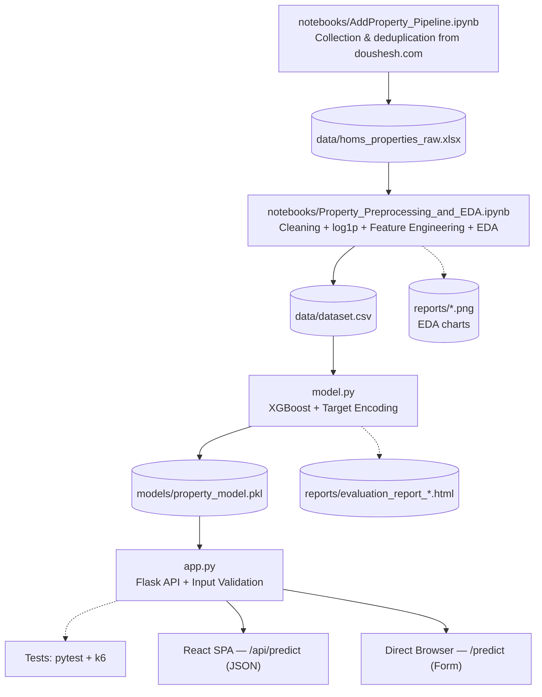

📖 Read in Arabic: [اللغة العربية](README_AR.md)

# 🏠 Homs Apartment Price Predictor — Sun Shadow AI Microservice

**Guided Price Estimation Service for Residential Apartments in Homs, Syria**

An independent, standalone **microservice** that provides **AI-based, guided price estimates** for residential apartments in the city of Homs, built on the **XGBoost** algorithm and a **Flask REST API**.

This service is the analytical module (AI-as-a-Service) within the **Sun Shadow** real estate platform (buy, sell, and rent). It runs fully decoupled from the main application (Laravel) and communicates with it — and with the React frontend — exclusively through a REST API, with no model logic embedded in any other application.

> ⚠️ **Methodological note:** This service is not intended to replace a specialized, on-site real estate appraisal. It provides a supporting quantitative price reference to help the user form an initial expectation of an apartment's expected price.

---

## 📑 Table of Contents

- [Key Features](#-key-features)
- [Tech Stack](#-tech-stack)
- [Frontend Integration Modes](#-frontend-integration-modes)
- [Project Structure](#-project-structure)
- [Data & Model Pipeline](#-data--model-pipeline)
- [Setup & Local Installation](#-setup--local-installation)
- [API Endpoints](#-api-endpoints)
- [Performance & Results](#-performance--results)
- [Notes & Scope of Use](#-notes--scope-of-use)

---

## ✨ Key Features

- **Offline/Online Separation (Training vs. Serving)**
  The model-building and training phase (`model.py → train()`) is separated — both in time and in structure — from the live serving phase (`app.py`). Training produces a persisted model bundle (`property_model.pkl` / `model_bundle.joblib`, see [Project Structure](#-project-structure)) that is loaded when the server starts, so the model can be retrained or updated without touching the API logic.

- **Logarithmic Price Transformation (Log1p Transformation)**
  The true price target is transformed to a logarithmic scale using `log1p` prior to training, to reduce the skew in the price distribution caused by a limited number of high-value apartments. Predictions are transformed back to the original USD scale using `expm1` at evaluation and inference time.

- **Derived Feature Engineering**
  - `area_per_room`: average room area (total area ÷ number of rooms).
  - `net_to_total_ratio`: ratio of net area to total area.
  - `has_heating`: binary indicator derived from the `heating_type` field.
  - `location_target_enc`: smoothed target encoding of the geographic location.

- **Smoothed Target Encoding for Locations**
  The mean log-price is computed per neighborhood, then blended with the global mean using a smoothing factor of `smoothing_k = 8`, so that a neighborhood with only one or two observed samples is not weighted the same as a neighborhood with a large, statistically reliable sample. Any location unseen at inference time automatically falls back to the global mean instead of passing an undefined value to the model.

- **Hyperparameter Tuning with Repeated Cross-Validation**
  `RandomizedSearchCV` (20 random trials) combined with `RepeatedKFold` (5 folds × 5 repeats = 25 evaluation operations), followed by a final refit that holds out 15% of the training data for validation with `Early Stopping` (40 rounds without improvement).

- **Strict Input Validation**
  The server enforces numeric bounds on area, room count, bathroom count, floor number, and building age, and validates categorical fields against allowed values (location, heating type, apartment condition, legal status), in addition to enforcing that `net_area` does not exceed `total_area × 1.05` (i.e., net area cannot exceed total area by more than 5%) — all before any data reaches the model.

- **Configurable CORS**
  An allow-list of origins (`ALLOWED_ORIGINS`) is configurable via environment variables, restricting access to the `/api/*` endpoints to trusted frontends only (defaults to React dev origins on ports 5173/3000/8080).

- **Independent Load Testing**
  A ramping-load scenario built with **Grafana k6** targets the `/api/predict` endpoint directly, fully isolated from the training pipeline.

---

## 🛠️ Tech Stack

| Category | Technology | Version |
| --- | --- | --- |
| Programming Language | Python | **≥ 3.10** |
| Service Framework | Flask | 3.0.3 |
| Underlying WSGI Server | Werkzeug | 3.0.3 |
| Cross-Origin Access Control | Flask-CORS | — |
| Machine Learning Model | XGBoost (XGBRegressor) | 2.1.1 |
| Machine Learning & Evaluation | Scikit-Learn | 1.5.2 |
| Tabular Data Processing | Pandas | 2.2.2 |
| Numerical Computing | NumPy | 1.26.4 |
| Probability Distributions for Random Search | SciPy | 1.13.1 |
| Model Bundle Persistence | Joblib | 1.4.2 |
| Load & Performance Testing | Grafana k6 | — |

> **Note:** `model.py` relies on modern Python union-type syntax (`dict | None`, [PEP 604](https://peps.python.org/pep-0604/)), which requires **Python 3.10 or later**. Running this project on an older interpreter will raise a `SyntaxError`.

---

## 🧩 Frontend Integration Modes

The service can be consumed through two independent frontend modes, matching two different consumption patterns:

| Mode | Description | Endpoint | Stack |
| --- | --- | --- | --- |
| **Flask SSR (embedded)** | Server-rendered HTML form built with Jinja2 templates (`templates/index.html`), submitted via a classic HTML form POST | `POST /predict` | Flask + Jinja2 + HTML Form |
| **React SPA (decoupled)** | Standalone, internationalized (i18n) single-page application that communicates with the microservice purely over REST, using Axios for HTTP calls | `POST /api/predict` | React + Axios + i18n |

Both modes share the exact same backend validation, feature-engineering, and inference pipeline — only the transport and rendering layer differ:

- **Flask SSR** is intended for direct in-browser testing of the estimator without needing a separate frontend build or dev server.
- **React SPA** is the production-facing, multi-language interface integrated into the wider **Sun Shadow** platform, and is the primary consumer of `/api/predict` in production.

---

## 📁 Project Structure

```
homs-apartment-price-predictor/
│
├── data/                             # Database directory
│   ├── homs_properties_raw.xlsx      # Raw scraped dataset (123 rows × 33 columns)
│   └── dataset.csv                   # Canonical, model-ready dataset (100 rows × 31 columns; output of the EDA notebook)
│
├── notebooks/                        # Offline data pipeline notebooks
│   ├── AddProperty_Pipeline.ipynb              # Manual single-listing ingestion + duplicate detection
│   └── Property_Preprocessing_and_EDA.ipynb    # Cleaning, feature engineering, EDA, dataset export
│
├── models/                           # Machine learning model directory
│   └── property_model.pkl            # Persisted trained model bundle (model + encoders + target-encoding map + medians)
│                                      # (see note below on the alternate filename)
│
├── reports/                          # Auto-generated reports and EDA visualizations
│   ├── evaluation_report_*.html      # Model evaluation report (e.g. evaluation_report_20260812_011947.html)
│   ├── target_variable_distribution.png   # Raw vs. log-transformed price distribution
│   ├── price_vs_area_trend.png            # Price vs. total area regression plot
│   ├── correlation_heatmap.png            # Correlation heatmap of numeric features
│   └── avg_price_by_location.png          # Average price by neighborhood
│
├── static/                           # Static assets and media for the UI
│   └── hero.jpg                      # Main hero image for the interface
│
├── templates/                        # Flask template files
│   └── index.html                    # Main user interface (Jinja2), served via /predict
│
├── tests/                            # Performance testing and code tests
│   ├── flask_summary.html            # HTML report generated by the k6 run
│   ├── flask_test.js                 # k6 load-testing scenario (targets /api/predict)
│   └── test_app.py                   # Unit tests for the Flask server
│
├── .gitignore                        # Files excluded from Git
├── app.py                            # Main entry point: Flask server and REST API endpoints
├── model.py                          # Data pipeline: cleaning, feature engineering, training, and inference
├── requirements.txt                  # Pinned dependency list with exact versions
├── README.md
└── README_AR.md
```

> **Note on `reports/` filenames:** the training pipeline in `model.py` generates a timestamped evaluation report (e.g. `evaluation_report_20260812_011947.html`); the exact filename changes with every run. The EDA notebook (`notebooks/Property_Preprocessing_and_EDA.ipynb`) saves its charts under lowercase snake_case names (`target_variable_distribution.png`, etc.) — align the on-disk filenames with this casing, or adjust the notebook's `plt.savefig` filenames, to keep the two in sync.

> **Note on `data/` contents:** the `data/` directory contains exactly two approved files — the raw source `homs_properties_raw.xlsx` (123 rows × 33 columns) and the processed, model-ready `dataset.csv` (100 rows × 31 columns). No other data files are part of this directory.

### Model Bundle Filename

`load_model()` in `model.py` first looks for `models/model_bundle.joblib`; if that file is not present, it falls back to `models/property_model.pkl` (the path produced by `train()`). In practice, only one of the two filenames will exist on disk after running the training pipeline as documented below — `property_model.pkl` — but both names are recognized by the loader, so either can be used to override the model artifact without changing the code.

### Model Bundle Contents (`property_model.pkl`)

Persisted with `Joblib`, the bundle contains everything required to reproduce the exact training-time preprocessing pipeline at inference time:

| Component | Description |
| --- | --- |
| `model` | The final trained `XGBRegressor` model |
| `features` | The feature ordering used during training |
| `label_encoders` / `label_encoder_modes` | `LabelEncoder` instances for categorical features, plus fallback values for unseen categories |
| `target_enc_map` / `global_log_mean` | The smoothed target-encoding map for locations and the global mean |
| `train_medians` | Training-set medians used to impute missing values |
| `binary_mappings` | The raw text values mapped to each binary feature (elevator, parking, furnished) |
| `metrics` | Model performance metrics (R², MAE, ±15% accuracy, cross-validation results) |

---

## 🔄 Data & Model Pipeline

The end-to-end pipeline that produces and serves the price-estimation model follows five sequential stages, from raw data collection to live inference. The first two stages run as Jupyter notebooks under `notebooks/`, using paths relative to that folder (i.e. `../data/`, `../reports/`) so they resolve correctly to the project's `data/` and `reports/` directories:



1. **Data collection** — `notebooks/AddProperty_Pipeline.ipynb` collects and deduplicates listings from [doushesh.com](https://doushesh.com/flats-for-sale/homs-1), reading and writing `../data/homs_properties_raw.xlsx` (i.e. `data/homs_properties_raw.xlsx` from the project root, 123 rows × 33 columns).
2. **Preprocessing & EDA** — `notebooks/Property_Preprocessing_and_EDA.ipynb` reads `../data/homs_properties_raw.xlsx`, cleans the raw data, applies the `log1p` price transformation, and engineers the derived features described in [Key Features](#-key-features). It exports the canonical, model-ready dataset (100 rows × 31 columns) to `../data/dataset.csv` and saves its EDA charts (correlation heatmap, price distributions, price-vs-area trend, average price by location) to `../reports/`.
3. **Modeling** — `model.py` (run from the project root) reads `data/dataset.csv`, trains the `XGBRegressor` model with smoothed target encoding for locations, and persists the bundle to `models/property_model.pkl`, alongside a timestamped HTML report in `reports/`.
4. **Serving & testing** — `app.py` loads the bundle and exposes it as a Flask REST API with strict input validation; the service is covered independently by `pytest` unit tests and `k6` load tests under `tests/`.
5. **Consumption** — the API is consumed either through the direct browser-based interface (`POST /predict`) or through the React SPA (`POST /api/predict`) — see [Frontend Integration Modes](#-frontend-integration-modes).

> **Working directory matters:** the notebooks use paths relative to `notebooks/` (`../data/`, `../reports/`), while `model.py` and `app.py` use paths relative to the project root (`data/`, `models/`, `reports/`). Run the notebooks with their working directory set to `notebooks/` (the default when opened via Jupyter from that folder) and run `model.py` / `app.py` from the project root, as shown in [Setup & Local Installation](#-setup--local-installation).

---

## ⚙️ Setup & Local Installation

### Prerequisites

- **Python 3.10 or later** (required — `model.py` uses PEP 604 union-type syntax such as `dict | None`, which is not supported on earlier versions)
- `pip` and `venv`
- (Optional) [Grafana k6](https://grafana.com/docs/k6/latest/) for running the load test

### Steps

**1) Clone the repository**

```bash
git clone https://github.com/DalaaAudi/homs-apartment-price-predictor.git
cd homs-apartment-price-predictor
```

**2) Create and activate a virtual environment**

```bash
python -m venv venv

# On Windows
venv\Scripts\activate

# On Linux / macOS
source venv/bin/activate
```

**3) Install dependencies**

```bash
pip install -r requirements.txt
```

**4) Prepare the dataset**

Place the processed dataset file `dataset.csv` inside the `data/` folder (the folder is created automatically on first run via `ensure_folders()` if it doesn't already exist).

**5) Train the model**

```bash
python model.py
```

This produces:
- A persisted model bundle at `models/property_model.pkl` (loadable as `model_bundle.joblib` as well — see [Model Bundle Filename](#model-bundle-filename)).
- An HTML evaluation report at `reports/evaluation_report_<timestamp>.html`.
- A training summary printed to the terminal, including R², MAE, and ±15% accuracy.

**6) Run the service**

```bash
python app.py
```

The server runs on port **`5092`** by default:

```
🏠 HOMS REAL ESTATE API v1.0.0
──────────────────────────────────────────────────
➜  Local Web UI:       http://127.0.0.1:5092/
➜  API Status Check:   http://127.0.0.1:5092/api/status
➜  Predict Endpoint:   http://localhost:5092/api/predict [POST]
──────────────────────────────────────────────────
```

**7) (Optional) Run the k6 load test**

With the server running on port `5092`:

```bash
k6 run tests/flask_test.js
```

This generates a `flask_summary.html` report in addition to a text summary printed to the terminal.

**8) (Optional) Run the React frontend**

The React SPA (see [Frontend Integration Modes](#-frontend-integration-modes)) lives in its own project and communicates with this microservice purely over REST. To run it in development mode:

```bash
cd <react-app-directory>
npm install
npm run dev
```

Ensure the React project's API base URL points to this service's local address:

```
http://localhost:5092
```

The React dev server's origin must also be included in `ALLOWED_ORIGINS` (see below) for CORS to permit its requests to `/api/predict`; the default value already covers the common Vite/CRA dev ports (`5173`, `3000`, `8080`).

### Environment Variables

| Variable | Description | Default |
| --- | --- | --- |
| `ALLOWED_ORIGINS` | Comma-separated list of CORS-allowed origins for `/api/*` | `http://localhost:5173,http://127.0.0.1:5173,http://localhost:3000,http://localhost:8080` |
| `FLASK_SECRET_KEY` | Secret key for Flask sessions (used by the `flash` mechanism) | Auto-generated random key if unset |

---

## 🔌 API Endpoints

### `POST /api/predict`

The service's primary endpoint. Accepts apartment specifications as JSON and returns the guided estimated price.

**Headers:**

```
Content-Type: application/json
```

**Example Request Body:**

```json
{
  "location": "الحمراء",
  "total_area": 120,
  "net_area": 100,
  "rooms_count": 3,
  "bathrooms_count": 2,
  "halls_count": 1,
  "floor_num": 2,
  "building_age": 5,
  "heating_type": "تدفئة ديزل",
  "house_condition": "مسكون من صاحبه",
  "legal_status": "طابو أخضر/نظامي",
  "near_hospital": 1,
  "near_market": 1,
  "has_elevator": 1,
  "has_parking": 0,
  "is_furnished": 0
}
```

**Successful Response — `200 OK`:**

```json
{
  "success": true,
  "predicted_price_usd": 87500,
  "price_per_sqm_usd": 729,
  "location": "الحمراء",
  "total_area_m2": 120
}
```

**Error Responses:**

| Status Code | Meaning | Cause |
| --- | --- | --- |
| `400` | Bad Request | The request body is not valid JSON, a field value is out of the allowed bounds, or the location/category is unrecognized |
| `503` | Service Unavailable | The model is not loaded (not yet trained, or `property_model.pkl` could not be loaded) |
| `500` | Internal Server Error | An unexpected internal error occurred during inference |

**Supported Request Fields and Bounds:**

| Field | Type | Bounds / Allowed Values | Required |
| --- | --- | --- | --- |
| `location` | string | Any location; unknown locations fall back to the global mean | ✅ |
| `total_area` | number | 20 – 1000 m² | ✅ |
| `net_area` | number | 15 – 1000 m² | Optional (defaults to 90% of total area) |
| `rooms_count` | integer | 1 – 10 | Optional (default 3) |
| `bathrooms_count` | integer | 1 – 5 | Optional (default 1) |
| `halls_count` | integer | 0 – 5 | Optional (default 1) |
| `floor_num` | integer | -3 – 15 | Optional (default 0) |
| `building_age` | number | 0 – 100 years | Optional (default 5) |
| `heating_type` | string | `لا يوجد`, `تدفئة ديزل`, `مدفئة ديزل`, `تدفئة مركزية` | Optional |
| `house_condition` | string | `مسكون من صاحبه`, `فارغ`, `مؤجر` | Optional |
| `legal_status` | string | `طابو أخضر/نظامي`, `كاتب عدل/وكالة`, `حكم محكمة` | Optional |
| `near_hospital` / `near_market` / `has_elevator` / `has_parking` / `is_furnished` | binary (0/1) | — | Optional (default 0) |

> **Consistency rule:** `net_area` must not exceed `total_area × 1.05` (i.e., net area cannot be more than 5% larger than total area). Requests that violate this rule return `400 Bad Request`.

---

### `GET /api/status`

Returns the model's load status and core metrics.

**Response — `200 OK` (model ready):**

```json
{
  "status": "ready",
  "model_name": "XGBoost (RandomSearch + RepeatedKFold)",
  "locations_count": 42,
  "r2_score": 0.7174,
  "accuracy_15pct": 28.0
}
```

**Response — `503 Service Unavailable` (model not ready):**

```json
{ "status": "not_ready", "error": "No model found." }
```

---

### `GET /api/locations`

Returns the list of neighborhoods (locations) known to the model, sorted alphabetically.

```json
{
  "success": true,
  "locations": ["الحمراء", "الوعر", "كرم الشامي", "..."]
}
```

---

### `POST /predict`

An endpoint dedicated to the embedded server-rendered UI (`templates/index.html`). It accepts form data (`multipart/form-data` or `x-www-form-urlencoded`) rather than JSON, and returns a rendered HTML page containing the estimation result instead of a JSON response. Intended for direct in-browser testing without going through the React frontend.

---

## 📊 Performance & Results

### Price Estimation Model Performance

| Metric | Value |
| --- | --- |
| R² (Test Set) | **0.7174 (71.74%)** |
| Repeated Cross-Validation R² | **0.7246 ± 0.1324** |
| Mean Absolute Error (MAE) | **15,459 USD** |
| Predictions within ±15% margin | **28.0%** |

> The R² value indicates that the model explains a meaningful share of the price variance on the test data, while MAE expresses the average magnitude of price error in USD. The limited gap between the cross-validation R² mean and the test-set R² is not, on its own, sufficient evidence of strong generalization; it is read together with the nature of the local real estate data used.

### Load Testing Results (Grafana k6)

A ramping-VUs scenario targeted the `/api/predict` endpoint directly:

| Metric | Value |
| --- | --- |
| Total HTTP Requests | **288 requests** |
| Failed Request Rate | **0.00%** |
| 95th Percentile Response Time (P95) | **98.40 ms** |

These results demonstrate service stability within the tested scenario, with no failed requests and a response time under 100 ms for 95% of requests. This result is not to be read as a guarantee of stable performance under arbitrary production load — it describes service behavior under the specific test configuration used.

---

## 📌 Notes & Scope of Use

- The service is built on real residential data collected from listings posted on a local real estate platform in Homs; it is not an official dataset published by that platform.
- The model currently covers residential apartments within the city of Homs only, and does not cover other property types (villas, commercial units, offices, land).
- The goal of the service is to provide a **guided price reference**, not a substitute for a specialized, on-site real estate appraisal when making actual buy/sell decisions.
- All preprocessing components (encoders, location target-encoding map, medians) are persisted within the model bundle itself, to guarantee that preprocessing steps are identical between the training phase and live inference.

---

## 🔗 Part of the Larger System

This service is one component of the **Sun Shadow** project — a full-stack real estate platform for buying, selling, and renting properties, developed as a graduation project at the Faculty of Informatics Engineering, Homs University, Department of Software Engineering and Information Systems.

- **Main Web Platform:** Laravel + MySQL
- **Frontend:** React
- **Price Estimation Service (this repository):** Flask + XGBoost
