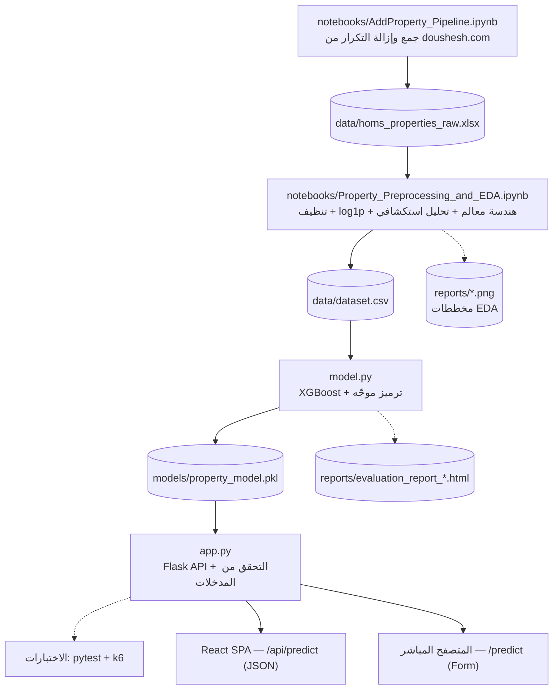

📖 Read in English: [English Version](README.md)

# 🏠 خدمة تقدير أسعار العقارات السكنية — مدينة حمص

**Homs Apartment Price Predictor — Sun Shadow AI Microservice**

خدمة مصغّرة (Microservice) مستقلة لتقديم **تقدير سعري استرشادي** للشقق السكنية في مدينة حمص، مبنية باستخدام خوارزمية **XGBoost** وواجهة برمجية **Flask REST API**.

تُشكّل هذه الخدمة الموديول التحليلي (AI-as-a-Service) ضمن منصة **Sun Shadow** لبيع وشراء وتأجير العقارات، وتعمل بصورة مستقلة تماماً عن التطبيق الرئيسي (Laravel)، حيث تتواصل معه ومع الواجهة الأمامية (React) عبر واجهة برمجية REST، دون تضمين منطق النموذج داخل أي تطبيق آخر.

> ⚠️ **ملاحظة منهجية:** هذه الخدمة لا تهدف إلى استبدال التقييم العقاري الميداني المتخصص، بل توفّر مرجعية سعرية كمية مساندة تساعد المستخدم على تكوين تصور أولي عن السعر المتوقع للشقة.

---

## 📑 جدول المحتويات

- [المميزات الرئيسية](#-المميزات-الرئيسية)
- [التقنيات والمكتبات المستخدمة](#-التقنيات-والمكتبات-المستخدمة-tech-stack)
- [أنماط تكامل الواجهة الأمامية](#-أنماط-تكامل-الواجهة-الأمامية)
- [هيكلية المشروع](#-هيكلية-المشروع-project-structure)
- [خط بيانات ونمذجة المشروع (Pipeline)](#-خط-بيانات-ونمذجة-المشروع-pipeline)
- [دليل التثبيت والتشغيل المحلي](#-دليل-التثبيت-والتشغيل-المحلي)
- [توثيق واجهات البرمجة (API)](#-توثيق-واجهات-البرمجة-api-endpoints)
- [مقاييس الأداء والنتائج](#-مقاييس-الأداء-والنتائج)
- [ملاحظات ونطاق الاستخدام](#-ملاحظات-ونطاق-الاستخدام)

---

## ✨ المميزات الرئيسية

- **فصل بيئة التدريب عن بيئة التشغيل (Offline / Online Separation)**
  مرحلة بناء النموذج وتدريبه (`model.py → train()`) منفصلة زمنياً وبنيوياً عن مرحلة الخدمة الحية (`app.py`). ينتج عن مرحلة التدريب حزمة نموذج محفوظة (`property_model.pkl`) تُحمَّل عند إقلاع الخادم، بحيث يمكن إعادة تدريب النموذج أو تحديثه دون المساس بمنطق الـ API.

- **المعالجة اللوغاريتمية للسعر (Log1p Transformation)**
  يُحوَّل متغير السعر الحقيقي إلى مقياس لوغاريتمي باستخدام `log1p` قبل التدريب للحد من التواء توزيع الأسعار الناتج عن وجود عدد محدود من الشقق مرتفعة الثمن، ثم تُعاد النتيجة إلى مقياسها الأصلي بالدولار باستخدام `expm1` عند التقييم والتنبؤ.

- **هندسة معالم مشتقة (Feature Engineering)**
  - `area_per_room`: متوسط مساحة الغرفة (المساحة الإجمالية ÷ عدد الغرف).
  - `net_to_total_ratio`: نسبة المساحة الصافية إلى المساحة الإجمالية.
  - `has_heating`: مؤشر ثنائي مشتق من نوع التدفئة (`heating_type`).
  - `location_target_enc`: الترميز الموجه الممهّد للموقع الجغرافي.

- **ترميز مستهدف ممهّد للمواقع (Smoothed Target Encoding)**
  يُحسب متوسط لوغاريتم السعر لكل حي، ثم يُمزج مع المتوسط العام باستخدام معامل تنعيم `smoothing_k = 8`، بحيث لا يعتمد النموذج على حي ظهر مرة أو مرتين فقط في البيانات بالقدر نفسه الذي يعتمد فيه على حي متكرر وموثوق إحصائياً. أي موقع غير معروف عند الاستدلال يُستبدل تلقائياً بالمتوسط العام بدلاً من تمرير قيمة غير معرّفة إلى النموذج.

- **ضبط معلمات فائقة وتقييم تقاطعي متكرر**
  `RandomizedSearchCV` (20 تجربة عشوائية) مع `RepeatedKFold` (5 طيات × 5 تكرارات = 25 عملية تقييم)، يليها إعادة تدريب نهائية مع تخصيص 15% من بيانات التدريب للتحقق وتفعيل `Early Stopping` (40 دورة دون تحسن).

- **تحقق صارم من المدخلات (Input Validation)**
  يفرض الخادم حدوداً عددية للمساحات وعدد الغرف والحمامات والطوابق وعمر البناء، ويتحقق من القيم الفئوية المسموحة (الموقع، التدفئة، حالة الشقة، الوضع القانوني)، إضافة إلى فرض ألّا تتجاوز المساحة الصافية (`net_area`) قيمة `total_area × 1.05` (أي لا يمكن أن تتجاوز المساحة الصافية المساحة الإجمالية بأكثر من 5%) — كل ذلك قبل وصول أي بيانات إلى النموذج.

- **دعم CORS قابل للتهيئة**
  قائمة نطاقات مسموحة (`ALLOWED_ORIGINS`) قابلة للتهيئة عبر متغيرات البيئة، لتقييد الوصول إلى نقاط `/api/*` من واجهات موثوقة فقط (React الافتراضية على المنافذ 5173/3000/8080).

- **اختبار أداء وحمل مستقل (Load Testing)**
  اختبار سيناريو تدريجي (Ramping) باستخدام **Grafana k6** يستهدف نقطة `/api/predict` مباشرة، بمعزل تام عن مسار التدريب.

---

## 🛠️ التقنيات والمكتبات المستخدمة (Tech Stack)

| الفئة | التقنية | الإصدار |
| --- | --- | --- |
| لغة البرمجة | Python | ≥ 3.10 |
| إطار عمل الخدمة | Flask | 3.0.3 |
| خادم WSGI الأساسي | Werkzeug | 3.0.3 |
| التحكم بسياسة المصادر | Flask-CORS | — |
| نموذج التعلّم الآلي | XGBoost (XGBRegressor) | 2.1.1 |
| التعلّم الآلي والتقييم | Scikit-Learn | 1.5.2 |
| معالجة البيانات الجدولية | Pandas | 2.2.2 |
| الحوسبة العددية | NumPy | 1.26.4 |
| التوزيعات الاحتمالية للبحث العشوائي | SciPy | 1.13.1 |
| حفظ حزمة النموذج | Joblib | 1.4.2 |
| اختبار الحمل والأداء | Grafana k6 | — |

> **ملاحظة:** يعتمد `model.py` على صياغة أنواع الاتحاد الحديثة في بايثون (`dict | None`, PEP 604)، لذلك تُشترط بايثون 3.10 أو أحدث.

---

## 🧩 أنماط تكامل الواجهة الأمامية

يمكن استهلاك الخدمة عبر نمطين مستقلين من الواجهات الأمامية، يعكسان نمطي استهلاك مختلفين:

| النمط | الوصف | نقطة النهاية | التقنيات |
| --- | --- | --- | --- |
| **Flask SSR (مدمجة داخل الخدمة)** | واجهة مُعالجة من جانب الخادم (Server-Rendered) مبنية بقوالب Jinja2 (`templates/index.html`)، تُرسَل عبر نموذج HTML تقليدي (Form) | `POST /predict` | Flask + Jinja2 + HTML Form |
| **React SPA (منفصلة)** | تطبيق صفحة واحدة (SPA) مستقل ومتعدد اللغات (i18n)، يتواصل مع الخدمة المصغرة بالكامل عبر REST باستخدام Axios لإجراء طلبات HTTP | `POST /api/predict` | React + Axios + i18n |

يتشارك النمطان تماماً نفس منطق التحقق من المدخلات وهندسة المعالم وخط الاستدلال في الخلفية — والفرق الوحيد هو طبقة النقل والعرض:

- **Flask SSR** مخصصة للاختبار المباشر من المتصفح دون الحاجة إلى بناء واجهة منفصلة أو تشغيل خادم تطوير خاص بها.
- **React SPA** هي الواجهة الإنتاجية متعددة اللغات المتكاملة ضمن منصة **Sun Shadow** الأوسع، وهي المستهلك الرئيسي لنقطة `/api/predict` في بيئة الإنتاج.

---

## 📁 هيكلية المشروع (Project Structure)

```
homs-apartment-price-predictor/
│
├── data/                              # مجلد قاعدة البيانات
│   ├── homs_properties_raw.xlsx       # البيانات الخام المجمّعة (123 صفاً × 33 عموداً)
│   └── dataset.csv                    # البيانات المعيارية الجاهزة للنموذج (100 صف × 31 عموداً؛ مخرج دفتر EDA)
│
├── notebooks/                         # دفاتر خط أنابيب البيانات دون اتصال (Offline)
│   ├── AddProperty_Pipeline.ipynb               # إدخال يدوي لعقار واحد + كشف التكرار
│   └── Property_Preprocessing_and_EDA.ipynb     # التنظيف، هندسة المعالم، التحليل الاستكشافي، وتصدير البيانات
│
├── models/                            # مجلد نماذج تعلم الآلة
│   └── property_model.pkl             # النموذج المدرَّب المحفوظ (النموذج + المشفّرات + خريطة الترميز + الوسطاء)
│                                       # (انظر الملاحظة أدناه حول الاسم البديل)
│
├── reports/                           # التقارير المولّدة تلقائياً ومخططات التحليل الاستكشافي
│   ├── evaluation_report_*.html       # تقرير تقييم النموذج (مثال: evaluation_report_20260812_011947.html)
│   ├── target_variable_distribution.png    # توزيع السعر قبل وبعد التحويل اللوغاريتمي
│   ├── price_vs_area_trend.png             # مخطط انحدار السعر مقابل المساحة الإجمالية
│   ├── correlation_heatmap.png             # خريطة الارتباط الحراري للمعالم العددية
│   └── avg_price_by_location.png           # متوسط السعر حسب الحي
│
├── static/                            # الملفات الثابتة والوسائط للواجهة
│   └── hero.jpg                       # الصورة الرئيسية للواجهة
│
├── templates/                         # ملفات القوالب لـ Flask
│   └── index.html                     # واجهة المستخدم الرئيسية (Jinja2)، تُعرض عبر /predict
│
├── tests/                             # مجلد فحوصات الأداء واختبارات الكود
│   ├── flask_summary.html             # ملخص التقرير المولّد لاختبارات k6
│   ├── flask_test.js                  # سكريبت اختبار الأداء k6 (يستهدف /api/predict)
│   └── test_app.py                    # اختبارات الوحدة (Unit Tests) لخادم Flask
│
├── .gitignore                         # ملف الملفات المستبعدة من Git
├── app.py                             # الخادم الرئيسي وواجهة البرمجة (Flask REST API)
├── model.py                           # خط معالجة البيانات وتدريب النموذج
├── requirements.txt                   # الاعتماديات والمكتبات
├── README.md
└── README_AR.md
```

> **ملاحظة حول أسماء ملفات `reports/`:** يُنتج خط التدريب في `model.py` تقرير تقييم مؤرَّخ زمنياً (مثال: `evaluation_report_20260812_011947.html`)؛ يتغير اسم الملف الدقيق مع كل عملية تدريب. أما دفتر التحليل الاستكشافي (`notebooks/Property_Preprocessing_and_EDA.ipynb`) فيحفظ مخططاته بأسماء بصيغة snake_case بحروف صغيرة (`target_variable_distribution.png` وما شابه) — يُرجى مطابقة أسماء الملفات الفعلية على القرص مع هذه الصيغة، أو تعديل أسماء الحفظ (`plt.savefig`) داخل الدفتر، لإبقاء الاثنين متطابقين.

> **ملاحظة حول محتويات `data/`:** يحتوي مجلد `data/` حصراً على ملفين معتمدين — البيانات الخام `homs_properties_raw.xlsx` (123 صفاً × 33 عموداً)، والبيانات المعالجة الجاهزة للنموذج `dataset.csv` (100 صف × 31 عموداً). لا يتضمن هذا المجلد أي ملفات بيانات أخرى.

### الاسم البديل لحزمة النموذج

تبحث `load_model()` في `model.py` أولاً عن `models/model_bundle.joblib`؛ فإذا لم يكن هذا الملف موجوداً، تتراجع إلى `models/property_model.pkl` (المسار الذي تنتجه `train()`). عملياً، سيوجد على القرص اسم واحد فقط من الاسمين بعد تشغيل خط التدريب كما هو موثّق أدناه — وهو `property_model.pkl` — لكن كلا الاسمين معروفان لدى المُحمِّل (loader)، لذا يمكن استخدام أي منهما لتجاوز حزمة النموذج دون تعديل الكود.

### مكوّنات حزمة النموذج (`property_model.pkl`)

تُحفظ باستخدام `Joblib`، وتحتوي على كل ما يلزم لإعادة إنتاج خط معالجة التدريب أثناء الاستدلال دون أي اختلاف:

| المكوّن | الوصف |
| --- | --- |
| `model` | نموذج `XGBRegressor` المدرّب النهائي |
| `features` | ترتيب المعالم المعتمد أثناء التدريب |
| `label_encoders` / `label_encoder_modes` | مشفّرات `LabelEncoder` للمعالم الفئوية والقيم الاحتياطية عند إدخال قيمة غير معروفة |
| `target_enc_map` / `global_log_mean` | خريطة الترميز الموجه الممهّد للمواقع والمتوسط العام |
| `train_medians` | وسطاء بيانات التدريب المستخدمة لتعويض القيم المفقودة |
| `binary_mappings` | القيم النصية المقابلة للمعالم الثنائية (مصعد، موقف، تأثيث) |
| `metrics` | مقاييس أداء النموذج (R²، MAE، الدقة ضمن ±15%، نتائج التقييم التقاطعي) |

---

## 🔄 خط بيانات ونمذجة المشروع (Pipeline)

يمرّ خط الأنابيب الكامل الذي ينتج النموذج ويُشغّله بخمس مراحل متسلسلة، من جمع البيانات الخام وحتى الاستدلال الحي. تعمل أول مرحلتين كدفاتر Jupyter ضمن `notebooks/`، باستخدام مسارات نسبية إلى ذلك المجلد (أي `../data/` و`../reports/`) بحيث تُحلّ بشكل صحيح إلى مجلدَي `data/` و`reports/` في جذر المشروع:



1. **جمع البيانات** — يقوم `notebooks/AddProperty_Pipeline.ipynb` بجمع الإعلانات وإزالة تكرارها من منصة [doushesh.com](https://doushesh.com/flats-for-sale/homs-1)، حيث يقرأ ويكتب من/إلى `../data/homs_properties_raw.xlsx` (أي `data/homs_properties_raw.xlsx` من جذر المشروع، 123 صفاً × 33 عموداً).
2. **المعالجة والتحليل الاستكشافي (EDA)** — يقرأ `notebooks/Property_Preprocessing_and_EDA.ipynb` الملف `../data/homs_properties_raw.xlsx`، وينظّف البيانات الخام، ويطبّق التحويل اللوغاريتمي `log1p` للسعر، ويهندس المعالم المشتقة الموضحة في [المميزات الرئيسية](#-المميزات-الرئيسية). يُصدِّر الدفتر البيانات المعيارية الجاهزة للنموذج (100 صف × 31 عموداً) إلى `../data/dataset.csv` ويحفظ مخططاته التحليلية (خريطة الارتباط، توزيع السعر، مخطط السعر مقابل المساحة، متوسط السعر حسب الحي) إلى `../reports/`.
3. **النمذجة** — يقرأ `model.py` (يُشغَّل من جذر المشروع) الملف `data/dataset.csv`، ويدرّب نموذج `XGBRegressor` مع الترميز الموجه الممهّد للمواقع، ويحفظ الحزمة في `models/property_model.pkl`، إلى جانب تقرير HTML مؤرَّخ زمنياً في `reports/`.
4. **التشغيل والاختبار** — يُحمِّل `app.py` الحزمة ويعرضها كواجهة برمجية REST عبر Flask مع تحقق صارم من المدخلات؛ وتُغطّى الخدمة بشكل مستقل باختبارات وحدة `pytest` واختبارات حمل `k6` ضمن `tests/`.
5. **الاستهلاك** — تُستهلك الواجهة البرمجية إما عبر واجهة المتصفح المباشرة (`POST /predict`) أو عبر تطبيق React (`POST /api/predict`) — انظر [أنماط تكامل الواجهة الأمامية](#-أنماط-تكامل-الواجهة-الأمامية).

> **ملاحظة حول مجلد العمل (Working Directory):** تستخدم الدفاتر مسارات نسبية إلى `notebooks/` (`../data/`، `../reports/`)، بينما يستخدم `model.py` و`app.py` مسارات نسبية إلى جذر المشروع (`data/`، `models/`، `reports/`). لذا، شغّلي الدفاتر مع ضبط مجلد العمل على `notebooks/` (وهو الوضع الافتراضي عند فتحها عبر Jupyter من ذلك المجلد)، وشغّلي `model.py` و`app.py` من جذر المشروع، كما هو موضح في [دليل التثبيت والتشغيل المحلي](#-دليل-التثبيت-والتشغيل-المحلي).

---

## ⚙️ دليل التثبيت والتشغيل المحلي

### المتطلبات الأساسية

- Python 3.10 أو أحدث (إلزامي — يستخدم `model.py` صياغة أنواع الاتحاد PEP 604 مثل `dict | None`، وهي غير مدعومة في الإصدارات الأقدم)
- `pip` و `venv`
- (اختياري) [Grafana k6](https://grafana.com/docs/k6/latest/) لتشغيل اختبار الحمل

### الخطوات

**1) استنساخ المستودع**

```bash
git clone https://github.com/DalaaAudi/homs-apartment-price-predictor.git
cd homs-apartment-price-predictor
```

**2) إنشاء وتفعيل البيئة الافتراضية**

```bash
python -m venv venv

# على Windows
venv\Scripts\activate

# على Linux / macOS
source venv/bin/activate
```

**3) تثبيت الاعتماديات**

```bash
pip install -r requirements.txt
```

**4) تجهيز البيانات**

ضع ملف البيانات المعالجة `dataset.csv` داخل مجلد `data/` (سيُنشئ الكود المجلد تلقائياً عند أول تشغيل إذا لم يكن موجوداً عبر `ensure_folders()`).

**5) تدريب النموذج**

```bash
python model.py
```

سينتج عن هذا الأمر:
- حزمة نموذج محفوظة في `models/property_model.pkl` (قابلة للتحميل أيضاً باسم `model_bundle.joblib` — انظر [الاسم البديل لحزمة النموذج](#الاسم-البديل-لحزمة-النموذج)).
- تقرير تقييم HTML في `reports/evaluation_report_<timestamp>.html`.
- ملخص تدريب مطبوع في الطرفية (Terminal) يتضمن R² وMAE ونسبة الدقة ضمن ±15%.

**6) تشغيل خادم الخدمة**

```bash
python app.py
```

يعمل الخادم افتراضياً على المنفذ `5092`:

```
🏠 HOMS REAL ESTATE API v1.0.0
──────────────────────────────────────────────────
➜  Local Web UI:       http://127.0.0.1:5092/
➜  API Status Check:   http://127.0.0.1:5092/api/status
➜  Predict Endpoint:   http://localhost:5092/api/predict [POST]
──────────────────────────────────────────────────
```

**7) (اختياري) تشغيل اختبار الحمل باستخدام k6**

بعد التأكد من أن الخادم يعمل على المنفذ `5092`:

```bash
k6 run tests/flask_test.js
```

سيُنتج الاختبار تقرير `flask_summary.html` إضافة إلى ملخص نصي في الطرفية.

**8) (اختياري) تشغيل واجهة React**

يعيش تطبيق React (انظر [أنماط تكامل الواجهة الأمامية](#-أنماط-تكامل-الواجهة-الأمامية)) في مشروعه الخاص، ويتواصل مع هذه الخدمة المصغرة بالكامل عبر REST. لتشغيله في وضع التطوير:

```bash
cd <react-app-directory>
npm install
npm run dev
```

تأكد من أن عنوان الـ API الأساسي في مشروع React يشير إلى عنوان هذه الخدمة محلياً:

```
http://localhost:5092
```

يجب أيضاً إدراج نطاق خادم تطوير React ضمن `ALLOWED_ORIGINS` (انظر أدناه) للسماح لطلباته بالوصول إلى `/api/predict` عبر CORS؛ القيمة الافتراضية تغطي بالفعل منافذ تطوير Vite/CRA الشائعة (`5173`، `3000`، `8080`).

### متغيرات البيئة (Environment Variables)

| المتغيّر | الوصف | القيمة الافتراضية |
| --- | --- | --- |
| `ALLOWED_ORIGINS` | قائمة نطاقات CORS المسموح لها بالوصول إلى `/api/*`، مفصولة بفواصل | `http://localhost:5173,http://127.0.0.1:5173,http://localhost:3000,http://localhost:8080` |
| `FLASK_SECRET_KEY` | مفتاح سرّي لجلسات Flask (يُستخدم لآلية `flash`) | مفتاح عشوائي يُولَّد تلقائياً إن لم يُحدَّد |

---

## 🔌 توثيق واجهات البرمجة (API Endpoints)

### `POST /api/predict`

النقطة الرئيسية للخدمة، تستقبل مواصفات الشقة بصيغة JSON وتُعيد السعر الاسترشادي المتوقع.

**Headers:**

```
Content-Type: application/json
```

**مثال على جسم الطلب (Request Body):**

```json
{
  "location": "الحمراء",
  "total_area": 120,
  "net_area": 100,
  "rooms_count": 3,
  "bathrooms_count": 2,
  "halls_count": 1,
  "floor_num": 2,
  "building_age": 5,
  "heating_type": "تدفئة ديزل",
  "house_condition": "مسكون من صاحبه",
  "legal_status": "طابو أخضر/نظامي",
  "near_hospital": 1,
  "near_market": 1,
  "has_elevator": 1,
  "has_parking": 0,
  "is_furnished": 0
}
```

**الاستجابة الناجحة — `200 OK`:**

```json
{
  "success": true,
  "predicted_price_usd": 87500,
  "price_per_sqm_usd": 729,
  "location": "الحمراء",
  "total_area_m2": 120
}
```

**استجابات الخطأ:**

| كود الحالة | الحالة | السبب |
| --- | --- | --- |
| `400` | Bad Request | جسم الطلب ليس JSON صالحاً، أو قيمة حقل خارج الحدود المسموحة، أو موقع/فئة غير معروفة |
| `503` | Service Unavailable | النموذج غير محمَّل (لم يتم تدريبه بعد أو تعذّر تحميل `property_model.pkl`) |
| `500` | Internal Server Error | خطأ داخلي غير متوقع أثناء الاستدلال |

**حقول الطلب المدعومة وحدودها:**

| الحقل | النوع | الحدود / القيم المسموحة | إلزامي |
| --- | --- | --- | --- |
| `location` | نص | أي موقع؛ غير المعروف يُعامَل بالمتوسط العام | ✅ |
| `total_area` | رقم | 20 – 1000 م² | ✅ |
| `net_area` | رقم | 15 – 1000 م² | اختياري (افتراضياً 90% من المساحة الإجمالية) |
| `rooms_count` | عدد صحيح | 1 – 10 | اختياري (افتراضي 3) |
| `bathrooms_count` | عدد صحيح | 1 – 5 | اختياري (افتراضي 1) |
| `halls_count` | عدد صحيح | 0 – 5 | اختياري (افتراضي 1) |
| `floor_num` | عدد صحيح | -3 – 15 | اختياري (افتراضي 0) |
| `building_age` | رقم | 0 – 100 سنة | اختياري (افتراضي 5) |
| `heating_type` | نص | `لا يوجد`, `تدفئة ديزل`, `مدفئة ديزل`, `تدفئة مركزية` | اختياري |
| `house_condition` | نص | `مسكون من صاحبه`, `فارغ`, `مؤجر` | اختياري |
| `legal_status` | نص | `طابو أخضر/نظامي`, `كاتب عدل/وكالة`, `حكم محكمة` | اختياري |
| `near_hospital` / `near_market` / `has_elevator` / `has_parking` / `is_furnished` | ثنائي (0/1) | — | اختياري (افتراضي 0) |

> **قاعدة الاتساق:** يجب ألّا تتجاوز `net_area` قيمة `total_area × 1.05` (أي لا يمكن أن تكون المساحة الصافية أكبر من المساحة الإجمالية بأكثر من 5%). الطلبات المخالفة لهذه القاعدة تُعيد استجابة `400 Bad Request`.

---

### `GET /api/status`

يعيد حالة تحميل النموذج ومقاييسه الأساسية.

**الاستجابة — `200 OK` (نموذج جاهز):**

```json
{
  "status": "ready",
  "model_name": "XGBoost (RandomSearch + RepeatedKFold)",
  "locations_count": 42,
  "r2_score": 0.7174,
  "accuracy_15pct": 28.0
}
```

**الاستجابة — `503 Service Unavailable` (نموذج غير جاهز):**

```json
{ "status": "not_ready", "error": "No model found." }
```

---

### `GET /api/locations`

يعيد قائمة المواقع (الأحياء) المعروفة لدى النموذج، مرتّبة أبجدياً.

```json
{
  "success": true,
  "locations": ["الحمراء", "الوعر", "كرم الشامي", "..."]
}
```

---

### `POST /predict`

نقطة نهاية موجّهة للواجهة الرسومية المضمّنة (`templates/index.html`)، تستقبل بيانات النموذج بصيغة `multipart/form-data` أو `x-www-form-urlencoded` بدلاً من JSON، وتُعيد صفحة HTML معروضة تحتوي على نتيجة التقييم بدلاً من استجابة JSON. مخصصة للاختبار المباشر من المتصفح دون الحاجة لواجهة React الأمامية.

---

## 📊 مقاييس الأداء والنتائج

### أداء نموذج التقدير السعري

| المقياس | القيمة |
| --- | --- |
| معامل التحديد R² (على مجموعة الاختبار) | **0.7174 (71.74%)** |
| التقييم التقاطعي المتكرر (Repeated CV R²) | **0.7246 ± 0.1324** |
| متوسط الخطأ المطلق (MAE) | **15,459 USD** |
| نسبة التنبؤات ضمن هامش ±15% | **28.0%** |

> تشير قيمة R² إلى أن النموذج يفسّر جزءاً مهماً من التباين في الأسعار ضمن بيانات الاختبار، بينما يعبّر MAE عن متوسط مقدار الخطأ السعري بوحدة الدولار. الفرق المحدود بين متوسط R² في التقييم التقاطعي وقيمته على مجموعة الاختبار لا يُقرأ منفرداً كدليل كافٍ على جودة التعميم، بل يُنظر إليه مع طبيعة البيانات العقارية المحلية المستخدمة.

### نتائج اختبار الحمل (Grafana k6)

سيناريو تدريجي (Ramping VUs) استهدف نقطة `/api/predict` مباشرة:

| المقياس | القيمة |
| --- | --- |
| إجمالي الطلبات المُنفّذة | **288 طلب HTTP** |
| نسبة الطلبات الفاشلة | **0.00%** |
| زمن الاستجابة عند المئين 95 (P95) | **98.40 ms** |

تُظهر النتائج استقرار الخدمة ضمن سيناريو الاختبار المنفَّذ من حيث عدم تسجيل أي فشل في الطلبات، مع زمن استجابة أقل من 100 ميلي ثانية لدى 95% من الطلبات. لا تُفسَّر هذه النتيجة كضمان لثبات الأداء تحت أي حمل إنتاجي محتمل، بل تصف سلوك الخدمة ضمن إعدادات الاختبار المحدد.

---

## 📌 ملاحظات ونطاق الاستخدام

- تعتمد الخدمة على بيانات سكنية حقيقية جُمعت من إعلانات معروضة على منصة عقارية محلية في مدينة حمص، وليست مجموعة بيانات رسمية منشورة من تلك المنصة.
- النموذج مُخصَّص حالياً للشقق السكنية ضمن نطاق مدينة حمص، ولا يغطي أنواع عقارية أخرى (فلل، محلات تجارية، مكاتب، أراضٍ).
- الهدف من الخدمة هو تقديم **مرجعية سعرية استرشادية**، ولا تُغني عن التقييم العقاري الميداني المتخصص عند اتخاذ قرارات فعلية بالشراء أو البيع.
- تُحفظ جميع مكونات المعالجة (المشفّرات، خريطة ترميز الموقع، الوسطاء) داخل حزمة النموذج نفسها، لضمان تطابق خطوات المعالجة بين مرحلتي التدريب والاستدلال الحي.

---

## 🔗 الجزء الأكبر من المنظومة

هذه الخدمة هي أحد مكوّنات مشروع **Sun Shadow** — منصة إلكترونية متكاملة لبيع وشراء وتأجير العقارات، مطوّرة ضمن مشروع تخرج في كلية الهندسة المعلوماتية بجامعة حمص، قسم هندسة البرمجيات ونظم المعلومات.

- **منصة الويب الأساسية:** Laravel + MySQL
- **الواجهة الأمامية:** React
- **خدمة التقدير السعري (هذا المستودع):** Flask + XGBoost
